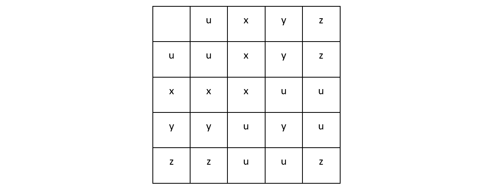
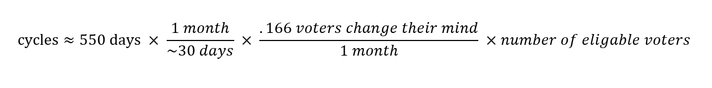
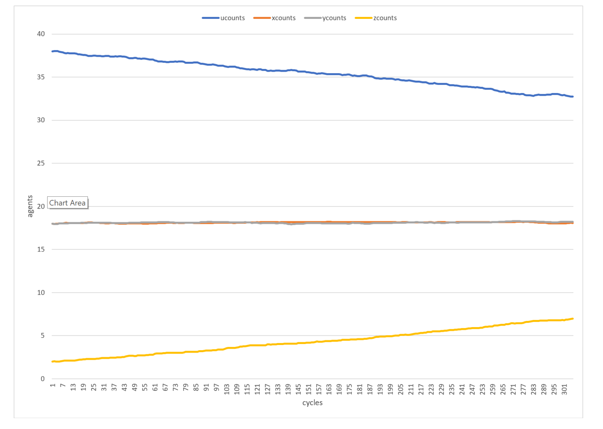
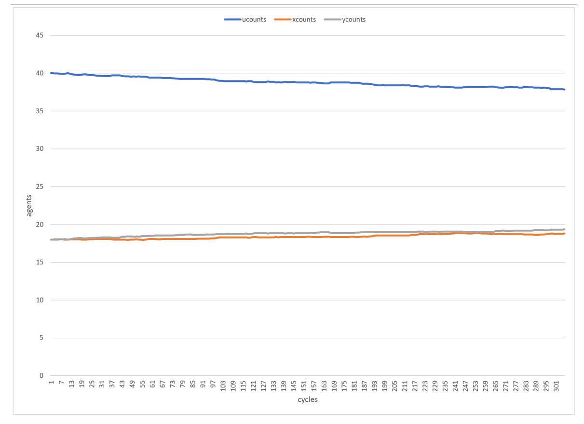
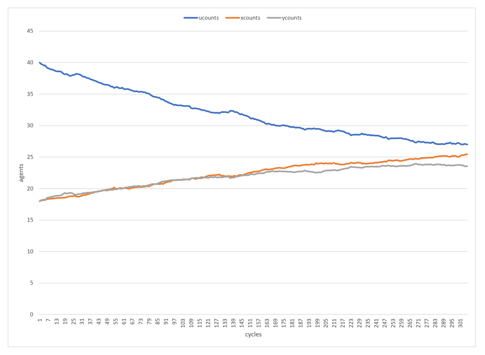
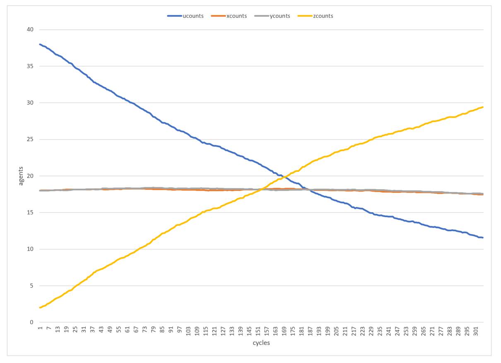

## Abstract 

In modern U.S. politics, there is a clear two-party system. Since the 1960s, there has been increased party polarization, voter abstention, and a low probability of any viable third party. The dynamics of two-party politics can be modeled using the approximate majority (AM) algorithm which has been previously used to study social dynamics. By factoring in third party presence into the model, I attempt to provide insights on the current state of affairs in U.S. politics. 

## Introduction 

Voter turnout is at an all-time low and party policy has never been so polarized. In the last 50 years, an average of 55% of the eligible population goes to the polls to vote. (U.S. Census Bureau, 2012) In a study by Callander and Wilson, the authors noted that decreased voter turnout is caused by increased party polarisation due to dissatisfaction with the candidates. Voters are often indifferent to the running parties or would rather abstain from voting rather than support a candidate for whom they disagree. (Callander & Wilson, 2007)
As the discontent amongst voters increases, there is a greater chance for third-party entry. In fact, this phenomenon was observed in 1992 when Ross Perrot gained traction with the electorate and amassed 18.8% of the votes. The decade in which Perrot ran was characterized by dissatisfaction with the dominant political parties, a desire to vote for someone other than a candidate for the Republican or Democratic party. In turn this led to a diminished role of the two dominant  parties in the American political process in the early 1990s. (Owen & Dennis, 1996) Antiparty sentiment ultimately paved the way for the success of Perrot in the US election. In Callander’s paper, he noted that the only way for a third-party entry to be successful is by differentiation of him or her self from the other dominant parties, which is what Perrot did. On the other hand, viable third-party entry is difficult when the candidate does not differentiate him or her self from the dominant two parties.
In the model, 3 simulations were developed to ask the following questions: What happens when a third party that is similar to the other 2 dominant parties enters the election? What happens when the 2 dominant parties are polarized, and the effect this has on voter turnout? What happens if the third party differentiates him or her self from the existing parties?

## Method

The model applied the social-learning AM algorithm to simulate voter interaction under competition for a single winner election. The AM algorithm was shown by Shultz to transform a majority idea into a consensus through local interactions. (Shultz, Montrey, & Aplin, 2017) There are three significant reasons why my algorithm is different from Shultz. First, in implementation, an undecided voter is converted into a decided voter by persuading the agent only if the probability of conversion is high enough with 4 different agent types. However, if the voter is already in a decided state and the persuading agent is convincing, the decided voter is then converted to the undecided state. This concept is formalized in table 1 where u represents an abstained voter state, x represents a vote for the Democratic party, y represents the Republican party, and z represents the third candidate.

Table 1:

Secondly, model interactions are done through an agent’s community, news network consumption, and social media interactions. These are considered to be “local” because agents who participate in those types of interactions often do so with others who are similar to them. This exact phenomenon has been studied by Yardi and Boyd where it has been noted that communication between like-minded individuals strengthens ingroup identity. (Yardi & Boyd, 2010)

Third, in Shultz’s articles, he strives to have all agents reach consensus, but this model will never have all agents converted because the entire campaign season is modeled. This is a fixed period so consensus can never be reached for a party. The number of cycles to run was set to 550 because this is the approximate number of days the campaign season lasts in modern U.S. politics. In fact, the second democratic debates for the November 2020 US elections already happened in July 2019!  (Caufield, 2019)

Although 550 cycles is a generous estimate, I assumed after one day’s worth of community interaction, the voter can change their mind. A more accurate estimate of necessary cycles needed to run would require additional factors to be taken into account. For example, about one voter out of six changes their mind one month before voting, as concluded by Blais in a study where voter preference was analyzed in more than 7 countries preceding an election day. (Blais, 2004) In my model, to calculate the number of cycles to run, if we assume 0.166 voters change their mind over the course of the month. We must account for the number of eligible voters present in the simulation to then estimate of the number of cycles that must be run in order to simulate the reality of the campaign season as seen below.

Probability of conversion is calculated based on voter appeal. It has been noted by Callander and Wilson that voter abstention has a major effect on election results. (Callander & Wilson, 2007) The voter would rather abstain than support a candidate who they feel does not represent their views. The voter may also abstain because they feel indifferent to any of those candidates. (Adams, Dow, & III, 2006) In my model, these 2 reasons are grouped into a singular factor. The more desirable a candidate is increases the probability of conversion because the voter either feels less alienated or has less indifference to the candidate. 

Before running each simulation, it was seeded with declared voters at the beginning of the campaign season. nu represents undeclared voters, nx represents declared voters for the democratic party, ny represents declared voters for the conservative party, and nz represents declared voters for the independent candidate. An additional factor, nb, depicted by byzantine agents that remain neutral throughout the entire campaign season. These are unregistered voters. 

## Results

0) Calculations 

24% of the voting-eligible population in the United States are not registered to vote (Wikipedia, 2019)

Approximately 40% of people are registered independents in the united states. (Jones, 2018)

Inverse correlation between voter preference and candidate polarisation, as observed by many sources. Preference is set at .1 for low preference and .9 for high preference. 

1) Third-party entry with similarity 

To simulate a scenario of third-party entry when the candidate has similar policy to the running parties, 30 simulations were run on 38u-18x-18y-2z-24b for 305 cycles. Party desirability is set at .1 for both the third party and existing dominant parties since candidate desirability is low for the dominant party, and our third candidate is similar in policy to the others running. Results signify that by the end of 550 cycles, we average at 13 wins for x, 12 wins for y, and 0 wins for z. We average at 32 abstained voters by the end of the race, 18 for the x and 18 for the y. Party z amasses some votes but due to established dominant parties, the third-party never wins any favour by the end of the simulated election season and thus is non-viable. This phenomenon is depicted in figure 1. 

Figure 1: Third Party Similarity

2) Two-party polarization and the effect on abstention

To simulate the scenario of differential party favourability, the simulation was seeded with 60u-30x-30y-0z-25b at 305 cycles. This simulation was designed to be a control for the following models to see the effect of voter abstention depending on preference for just the established running candidates. Party preference is set to be at .9 for when preference for both parties is higher and .1 when preference is lower. Consequences of the differential favourability can be seen in figures 2 and 3. We average at 15 wins for parties x and y in figure 3 with similar results in figure 2.

Figure 2: Polarized Two-Party System

Figure 3: Non-Polarized Two-Party System

3) Third-party entry with differentiation

To simulate third-party entry, when the candidate manages to differentiate himself from the established dominant parties, the simulation was seeded at 38u-18x-18y-2z-24b for 305 cycles. 30 simulations were run in total to see the effect on outcome in each race and averaged to see the effects on turnout. Third-party desirability was set at .9 whereas the established candidates were set at .1 due to lack of preference. 

Figure 4: Third Party Differentiation 

## Discussion

In section 2, when setting favourability to low for the main candidates, there was a higher number of abstained voters by the end of the season when voter alienation was high as compared to trials when alienation was low. This trial was meant to display the scenario when candidates have polarized policies that appeal to a small subset of the population. 

Third parties are guaranteed to lose the race when they have similar policies to the dominant parties.  Only when the party can show differentiation from the existing candidates is he or she able to gain any traction and amass enough votes to win the race, as seen in section 3. At the end of the simulation, there are 3 key observations that must be made. First, a third party is able to take votes from dominant parties as the support for the primary candidates dwindle progressively and as cycles continue. Second, the third party was successful despite a large existing majority. We seeded the simulation with just two voters that declared to support the independent candidate, but with preference above that of the dominant parties, it resulted in a high turnout for the third-party candidate. With higher appeal, there is less alienation and thus higher turnout. Thirdly, in section 1, when the third party is similar to the existing dominant polarized parties, the former does not succeed which indicates that the third party is appealing to a smaller population pool that is already taken up by the dominant candidates. 

Limitations of my model include that I made an arbitrary decision to quantify preferability such that when there is alienation and indifference, there is also low preference. I would have liked to do more research in order to find more factors that influence party preference. Additionally, there is a single probability of conversion for both parties x and y which indicates how similar they are versus how polarized they are. When they are more polarized the model sets alienation to high and thus probability of conversion is low. In the future, I would like to create a separate conversion factor for each party in order to see what would happen when only one candidate is extreme in policy while the other appeals to more voters. 

## Conclusion

This model was designed to simulate the electoral season in the United States and determine how voter alienation and indifference towards polarized parties can affect voter turnout.  More indifference to the established parties in election season gives opportunity for a third-party candidate to differentiate him or her self among his competitors and amass higher voter preference to then increase the total voter turnout in his or her favour. In fact, the amount of polarisation between the 2 main party candidates begs the question of effective political representation. In summary, when more voters are represented, there is less abstention by the end of the race. 

## References 

Adams, J., Dow, J., & III, S. M. (2006). The Political Consequences of Alienation-Based and Indifference-Based Voter Abstention. Political Behavior, Vol. 28, No. 1 (Mar., 2006), pp. 65-86.

Blais, A. (2004). How Many Voters Change Their Minds in the Month Preceding an Election? American Political Science Association, Vol. 37, No. 4 (Oct., 2004), pp. 801-803.

Callander, S., & Wilson, C. H. (2007). Turnout, Polarization, and Duverger's Law. The Journal of Politics, 1047-1056.
Caufield, R. (2019, July 30). How did the presidential campaign get to be so long? Drake University.

Jones, J. (2018, January 8). Americans' Identification as Independents Back Up in 2017.
Owen, D., & Dennis, J. (1996). Anti-partyism in the USA and support for Ross Perot . European Journal of Political Research, 383-400 .

Shultz, T. R., Montrey, M., & Aplin, L. M. (2017). Modelling the spread of innovation in wild birds. The Royal Society.

U.S. Census Bureau. (2012). Statistical Abstract of the United States. 

Wikipedia. (2019, October 23). Voter registration in the United States.

Yardi, S., & Boyd, D. (2010). Dynamic Debates: An Analysis of Group Polarization Over Time on Twitter. Bulletin of Science, Technology & Society.

