## Abstract 

Boltzmann machines are a specific type of parallel distributed processing model designed for unsupervised learning. The machine is split up into hidden and visible units where the goal of the hidden units is to capture higher-order weak constraints of the visible units that the world provides. The machine has successfully learnt once the output is indistinguishable from it’s input in its absence.

The purpose of this exercise is three-fold:

1) To get familiar with a canonical, yet slightly esoteric, neural network model, so that I don’t fall prey to the idea that neural networks are all deep convolutional networks.

2) To think about the actual learning algorithm for a neural network and how to implement that in code in an elegant manner.

3) To engage in some more in depth thought about unsupervised learning and the relationship between unsupervised learning and brains.

## Defining a Boltzmann machine using the eight elements of the PDP framework

1) A set of Processing units 

Total processing units = v (visible units) ∧ h (hidden units)

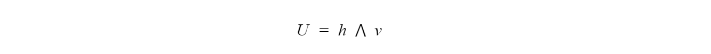

2) A state of activation at time t for each unit.  Initialized to a randomized binary state for each unit (for hidden) upon creating the machine.

3) An output function for each unit. o(t) = [oi(t) = f(ai(t))]^t where f(ai(t)) is some function that defines neural activity such that

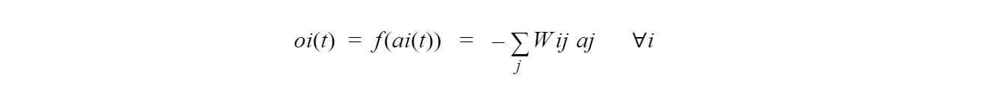

4) A pattern of connectivity between all of the units. 
Where all the units are “well connected” in the hidden layer and all visible units only make connections to hidden units (and not to themselves).

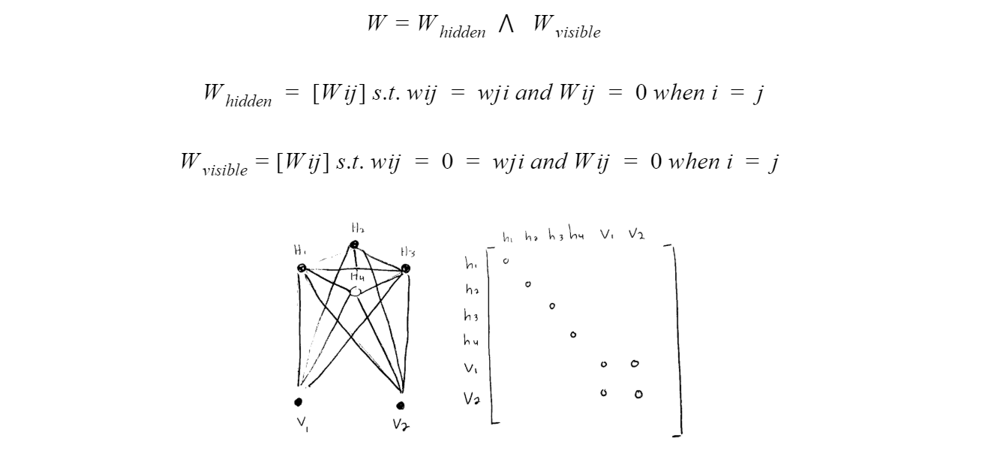

5) A propagation rule for sending activity between units. 
This propagation rule is dictated by gibbs sampling. Here we see if a unit i at time t will be active or not given the state of activations of all other units at the previous time step. Since all the hidden units are well connected, the activation of all the other units plays a role in unit i’s activation. From this equation, a probability of activation will be recovered and then unit i will be turned on at this probability.

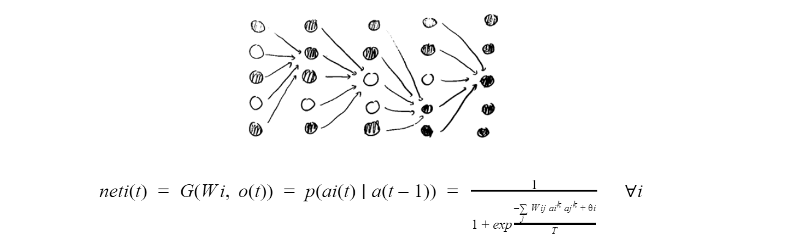

6) An activation rule for combining the propagated activity with current activity. 
In older networks (a) = net(t) and this is an example older network.

7) A learning rule. 
Modifying the weights is dependent on how much the Boltzmann “dream phase” reflects “reality”. As the expected value or the dream phase converging with that of the awake phase, weight modifications will cease and the system will be in a state of equilibrium. In this system, there is Hebbian plasticity during the awake phase, anti-Hebbian plasticity during the dream phase. 

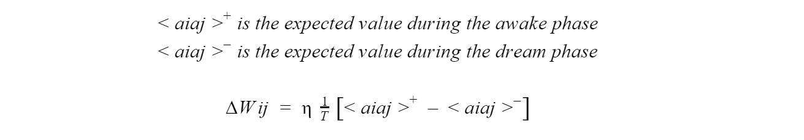

8) n environment that provides inputs to some subsets of the units. In this experiment, during the awake phase we will be clamping an image to the visible units and during the dream phase there will be no environmental input. This way, the job of the units in the dream phase is to recreate the images received during its awake phase.

## The Loss Function

We are trying to minimize the difference between the awake and dream probabilities using the loss function. Once this is minimized, the dream state of the Boltzmann machine will reflect reality. The way in which we are progressively reducing the loss function L is by performing a gradient descent. 

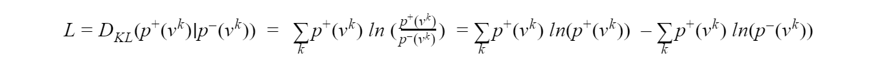

## Partial derivative of the Loss function with respect to a Synaptic Weight

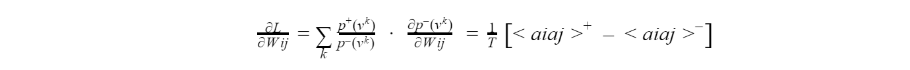

We need to calculate the expected value of activation between 2 units in the awake phase and the dream phase. To do this we must take the derivative of learning with respect to the pattern of connectivity between all of the units. Vk represents the setting for the visible units with stimulus k. Vk → ai(t) = {0...1} for every i in V (the set of visible units). p+(Vk) = probability of setting the visible units with stimulus k according to the input image (our awake phase). p-(Vk) = probability of setting the visible units with stimulus k according to output (our dream phase).

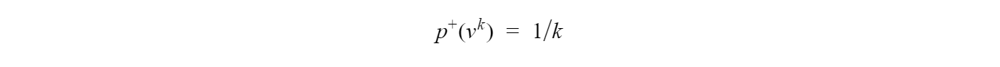

There’s only k possible activations of the visible units and when you are observing the activation due to 1 particular image, you can only have 1 of the k possible activations during the awake phase

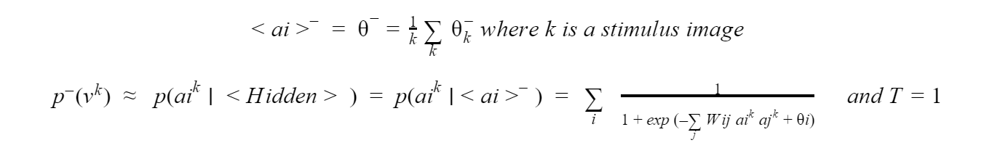

The probability of activation of a visible unit during the dream phase is dependent on the expected activation of all the hidden units during the sleep phase. Temperature is set to 1 because Loss is only calculated at the end of the simulation

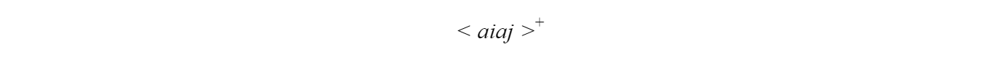

This is the expected coactivation matrix during the awake phase of the boltzmann machine.

This is the expected coactivation matrix during the sleep phase of the boltzmann machine.

## The “temperature” of a Boltzmann Machine

Temperature controls the entropy of the system. With high entropy, all states are equally likely because energy difference does not matter as much between states allowing equilibrium to be reached at a faster pace. With low entropy, the energy difference matters more and more. As a result, equilibrium is reached more slowly at a low entropy level since. 

## The “Annealing Schedule” of a Boltzmann Machine
	
This avoids the "pitfalls" of gradient descent, preventing the reaching of a "local minima" in favor of resting at a more global minimal state. To achieve this, the system moves from a high temperature to a low one reaching global minimum according to different rates (defined in our annealing schedule). When the temperature is high equilibrium is reached faster. When the temperature is low, equilibrium is reached more slowly (as bias to remain in this low energy state is high). So we set the annealing schedule such that we start with a high temperature at early time steps (to quickly find the minima of the system) and bring down the temperature (narrow our focus on a global minima).
	
## The Implied Theory of what Dreams are

The goal is to forget your dreams and focus on reality in the context of the Boltzmann Machine. We want the bolzmann’s dreams to look as much like reality as possible. To do this, we want to reduce the difference between the awake probabilities (input probabilities) and dream probabilities (output probabilities) and this is where the loss function comes in. By decreasing loss, we make it such that the output of our system is indistinguishable to the input of our system. 

In other, fancier words, the goal is to forget our dreams and focus on reality. 

## Variables included in my Boltzmann Machine Class

1) An annealing schedule.
This is to control the overall temperature in my system when it comes to performing a gibbs sampling for a particular stimulus image. For every one of the k stimulus images, the schedule is reset so that equilibrium can be discovered for the system

2) Hidden and visible unit activations.
Hidden units are set to a random binary number upon creation.
Visible units are clamped during the awake phase and empty during the sleep phase.

3) Hidden and visible unit thresholds
This is set to a random binary number upon creation.

4) Hidden and visible unit weights
Where all the units are “well connected” in the hidden layer and all visible units only make connections to hidden units (and not to themselves

5) Necessary components to calculate the change in synaptic weight Wijsuch as the expected activation during the awake phase and the expected value of activation during the asleep phase. 
The calculation of delta Wij can only be done once the system has run through all k stimulus images. 

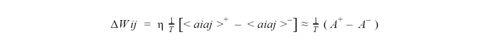

A+ is the expected value of activation of both hidden and visible units over k images. This is derived from Ak+ where this is the outer product of visible and hidden activations during the awake phase for a given stimulus. A- is derived from just a singular run of asleep gibbs sampling during the asleep phase. 

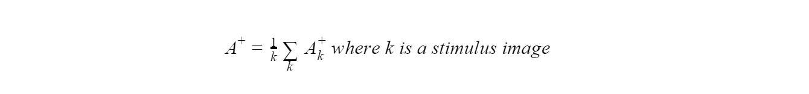

So in my program, I have delta Wij, A+, A-, and Ak+ stored as a global variable

6) Necessary components to calculate delta theta. 
A similar approach as above is taken to calculate the change in threshold of the units. The only key difference is that this is the average activation instead of an outer product. 

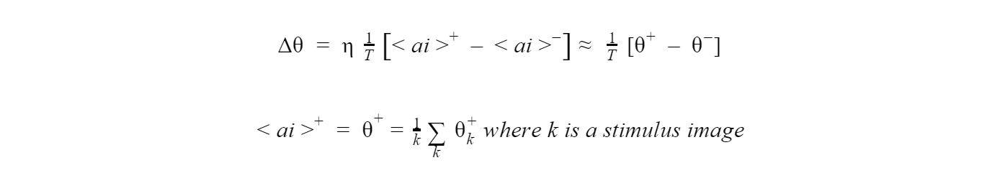

So in my program, I have delta theta, theta+, theta-, and thetak+ stored as a global variable

## Calculating Weight Updates in the Network

## Defining the annealing and training schedule

For the annealing schedule, temperature updates will be hard coded at various time steps in the model. Temperature will start high and slowly decrease to 1 over the course of n annealing steps.

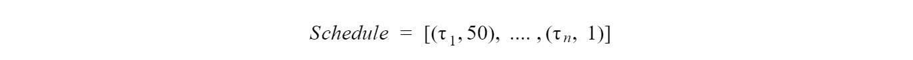

As for the training schedule, the system will train until a state of equilibrium is reached. This is once the probability of visible unit activation (input activation of the machine. The actual value) matches that of hidden unit activation (output activation of the machine)

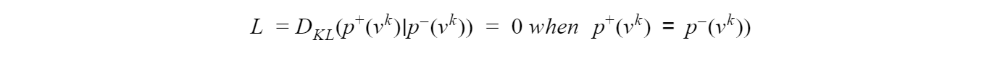

This is idealistic, so instead we would like to see L minimized as much as possible. 

## Conluding Observations

he model does not effectively reduce loss and so it does not “learn” efficiently. If I were to redo the model, I would put further effort into understanding how vamp up the equations, so the model learns correctly.

what has my machine learnt?

My machine has not learnt how to capture the higher order weak constraints of the images that were clamped to the visible units. Thus, I can classify my machine as an “unhealthy” brain. Brains that are healthy are able to take in information from the environment, resolve ambiguities, discover weak constraints on the environment, integrate many constraints at once, and perform its required task. All of which my machine does not do.

To summarize, my machine is essentially a high effort rock. 

Had my machine been able to discover anything about the MNIST images, it would at the bare minimum be able to discover higher order weak constraints of the environment. This would still not be equivalent to a healthy brain though as it can only do this one particular function! A proper AI that is functionally equivalent to a brain would also need to be able to resolve ambiguities and take in many constraints it has not previously seen before. What would happen if I obscured the MNIST images like a captcha? Like other AIs made to solve this task, the boltzmann machine couldn't do it. 

If the boltzmann machine has never been clamped with a novel image before, then how can it’s dreams look like something it has never yet seen?

To conclude, even a healthy Boltzmann is not really a “healthy brain”.